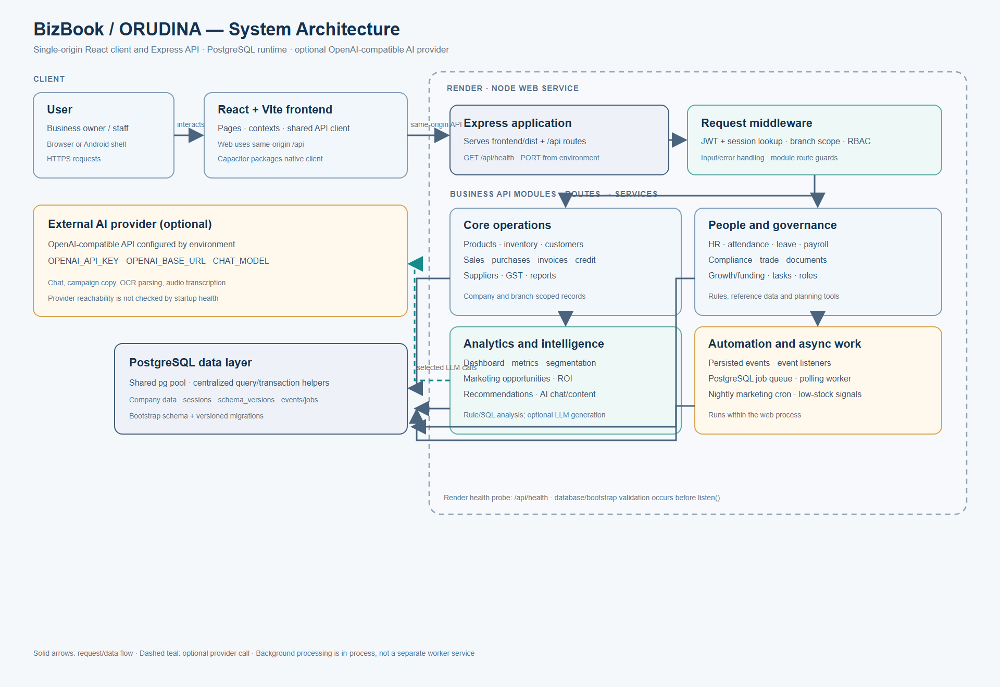
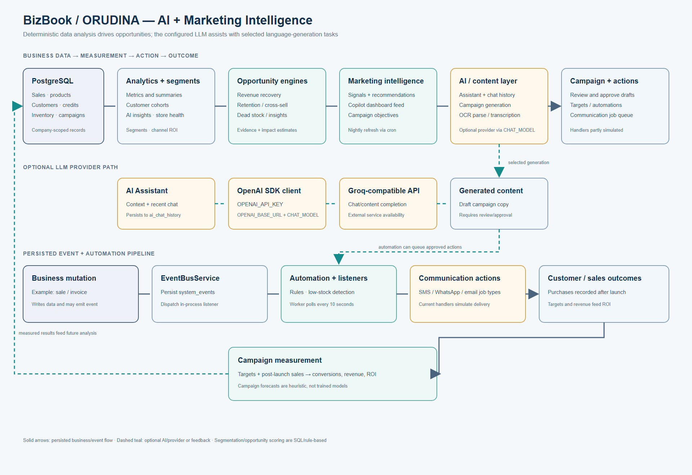

# BizBook / ORUDINA

BizBook (also branded ORUDINA in parts of the application) is a multi-module business operations platform for small businesses. It combines sales and inventory workflows with customer management, workforce tools, compliance support, trade references, growth planning, and data-backed marketing intelligence.

This guide describes the implementation present in this repository. It distinguishes working application paths from deterministic estimates, fallback behavior, and areas that are not yet connected to external providers.

## Product overview

### Problem and users

Small retailers and MSMEs often manage sales, stock, customers, invoices, employees, and follow-up work in separate tools. BizBook brings those day-to-day records into one company-scoped application and derives operational summaries and marketing opportunities from the stored data.

The UI and business language are oriented toward Indian small businesses: the code includes GST workflows, INR-oriented copy, Indian compliance/trade reference data, and MSME growth planning. The repository does not define a formal market segment or claim regulatory certification.

### Implemented capabilities

- **Business operations:** company setup/profile, products and product groups, purchases, inventory/stock, suppliers, customers, credit tracking, sales, invoices, and reports.
- **Dashboard and analytics:** sales summaries, revenue trends, top/low-performing products, stock conditions, profit, pending invoices, customer summaries, group comparisons, and rule-based insights.
- **Authentication and access:** registration/login, password hashing, seven-day JWTs, database-backed session revocation, company/branch scoping, roles, granular permissions, invitations, and audit-log routes.
- **AI assistant:** company-scoped business context, strategic opportunity context, persisted chat history, optional chat completions, OCR parsing, and optional audio transcription through the configured OpenAI-compatible API.
- **Marketing intelligence:** SQL-derived customer segments and opportunity signals, recommendation feeds, store-health scoring, channel ROI ranking, campaign drafting, campaign approval, campaign records, and ROI calculations from recorded post-launch sales.
- **Automation and events:** persisted domain events, an in-process event dispatcher, a PostgreSQL-backed background-job queue, periodic workers, and a scheduled marketing analysis job.
- **People operations:** employee directory/profile, branches, departments, teams/groups, attendance, leave requests, payroll records, employee documents, roles, and audit routes.
- **Compliance:** company compliance profile/items, rule/category reference data, document records, due-date/status summaries, reminders, meetings, and CSV/HTML reports.
- **Trade:** country/authority/guideline reference data and requirement-oriented trade views.
- **Growth and funding:** readiness/dashboard, cap table, dilution and valuation calculations, investors, funding pipeline, due diligence, roadmap, schemes, IPO checklist, notes, and an advisor chat path.
- **Tasks and documents:** task/workforce workflows, document upload/list/download paths, invoice rendering/export, and GST exports.
- **Voice and OCR:** browser audio upload/transcription, invoice-image OCR using Tesseract, then model-assisted parsing and product matching.

### Architecture

#### System architecture



*Figure 1. The web/mobile clients call a single Express service. Express serves the built web app and routes API requests through shared authentication and access-control middleware to PostgreSQL-backed modules and configured external AI services.*

**How the system works:** The web app uses same-origin `/api` requests; Vite proxies those requests to the local backend during development. Capacitor builds package the frontend for native shells. In the Render blueprint, one Node service builds the Vite assets, starts Express, and serves both the frontend and API. PostgreSQL is accessed through a shared `pg` pool.

#### AI and Marketing Intelligence



*Figure 2. Marketing insights begin with business records and deterministic SQL/rule engines. The configured LLM is used for selected chat and content-generation tasks; campaign outcomes are calculated from recorded campaign targets and sales.*

**How the system works:** PostgreSQL records feed analytics, customer segmentation, and opportunity engines. The Marketing Intelligence path creates signals/recommendations and can draft campaign content through the configured provider. Approved campaigns and automation jobs are persisted. Later sales records feed ROI calculations and future intelligence runs. Some prediction values and messaging actions remain deterministic or simulated; see [known limitations](#known-limitations-and-next-steps).

More implementation detail is in [Technical Architecture](docs/TECHNICAL_ARCHITECTURE.md).

#### Frontend architecture

- React 18 application bootstrapped in `frontend/src/main.jsx`.
- `frontend/src/App.jsx` owns the application shell/page selection; context providers handle authentication, theme, toast messages, and shared AI UI.
- `frontend/src/api/client.js` is the shared request client. Web builds use relative `/api`; Vite proxies this to `http://localhost:5003`. Capacitor-native builds currently use the absolute URL `https://orudina.onrender.com/api`; verify/update it if the production API domain changes.
- Vite creates `frontend/dist`; Express serves this directory in the single-service Render deployment.
- `frontend/android` and Capacitor dependencies indicate a native Android packaging path. They do not represent a separate native backend.

#### Backend architecture

- Node.js (repository `.node-version`: 22.17.0) and Express 4, CommonJS modules.
- Entry point: `backend/src/server.js`; application setup/routes: `backend/src/app.js`.
- Routes are split by business domain under `backend/src/routes`; reusable logic sits in `backend/src/services`.
- `backend/src/middleware` provides authentication, branch scoping, AI/OCR rate limits, and error handling.
- Startup validates database/schema/auth operations before listening. Healthy startup then starts cron jobs, event/job workers, listeners, and the automation engine.

#### PostgreSQL and migrations

- Runtime queries go through `backend/src/config/dbEngine.js` and `backend/src/config/pgDb.js` to a shared `pg` pool in `backend/src/config/pgPool.js`.
- `DATABASE_URL` takes precedence. Local `PGHOST`, `PGPORT`, `PGUSER`, `PGPASSWORD`, and `PGDATABASE` settings are the fallback.
- `backend/src/db/schema.postgres.sql` is the fresh-database schema. `pgDb.bootstrapPostgresSchema()` applies it once to an uninitialized database. Numbered, transactional migrations in `pgDb.runPostgresMigrations()` update already bootstrapped databases and record versions in `schema_versions`.
- `backend/src/db/seed.js` applies bootstrap/migrations and checks reference data. It does not create demo users or business records.
- The app runs bootstrap and migrations during startup as well as through `npm run seed`.
- PostgreSQL Compose service is named `postgres` and maps container port 5432 to local host port 5433. Its development credentials are defined in `docker-compose.yml`; use those only for local development, never production.
- `sqlite3` remains declared in `backend/package.json`, and a few legacy/unwired utilities/backups contain SQLite-oriented code. The active server database path shown above uses PostgreSQL; the dependency should be removed only after those remaining references are audited.

#### Authentication and sessions

Passwords are hashed with bcryptjs. `authService` signs JWTs with `JWT_SECRET` and sets a seven-day expiry. The authentication middleware validates the JWT and looks up a SHA-256 token hash in the `sessions` table so revoked sessions can be rejected. A session-lookup database failure returns 503; an invalid or revoked session returns 401. Company/branch scope and RBAC checks follow authentication. `JWT_SECRET` must exist before auth modules load.

#### AI and Marketing Intelligence

The backend uses the OpenAI Node SDK with `OPENAI_BASE_URL`, allowing an OpenAI-compatible provider such as Groq. The key variable used by this repository is `OPENAI_API_KEY`; model selection is `CHAT_MODEL` (default `openai/gpt-oss-120b`), and voice transcription has a separate `WHISPER_MODEL`. Do not place real values in source control.

The main assistant gathers metrics and optional opportunity context, uses recent company/session chat history, calls the provider when a key is configured, and stores the exchange in `ai_chat_history`. Without a provider key, the main assistant may return a testing/fallback response rather than an LLM answer. Marketing opportunity/segment calculations are primarily SQL and rules; the LLM drafts selected campaign content. Store-health scoring, channel ROI ranking, campaign predictions, and dashboard recommendation paths exist, but some projected values are heuristic. Startup health metadata checks key presence, not provider reachability.

Marketing intelligence includes revenue recovery, customer retention, dead-stock, cross-sell and related insight paths, customer segments, signals, recommendations, campaign drafts/approval, and ROI calculations. The scheduled marketing cron rebuilds signals and graph edges nightly. ROI is based on target customers and sales recorded after launch; forecast fields are not all model-based.

#### Automation and events

`EventBusService` persists events in `system_events` and dispatches them to in-process listeners. `AutomationEngine` loads active rules and reacts to configured event types. `JobQueueService` persists background work; `jobWorker` sweeps pending jobs/events every ten seconds. `inventoryListener` reacts to invoice-created events to detect low stock. `marketingCron` schedules its analysis for 02:00 according to the service process timezone. These workers run inside the web process; they are not separate Render worker services.

#### Other modules

- **Compliance:** database-backed profile/items/rules, applicability and due-date calculations, uploads/document metadata, reminders, meeting records/minutes, and exports. Curated defaults are reference data; the tool is not a substitute for professional legal advice or a guarantee of compliance.
- **HR/payroll:** employees, org structures, attendance, leaves, payroll records, and document routes. The HR copilot is deliberately data-summary/rule-based and does not call an LLM; letter generation reports unavailable.
- **Trade:** reference datasets for countries, authorities, and guidelines, plus requirement-oriented application flows. This is not a live customs/legal rules feed.
- **Growth/funding:** company readiness and planning records, cap table/dilution/valuation calculations, investor directory/CRM data, scheme references, roadmap, diligence, and advisor routes. Prediction values include deterministic heuristics.
- **Tasks/documents:** company-scoped workforce tasks, employee/compliance documents, invoice files, and generated exports. Uploaded files are stored on the service filesystem in code-defined locations; ephemeral hosting filesystems do not provide durable storage by themselves.
- **Analytics:** PostgreSQL queries produce sales, revenue, product, inventory, customer, profit, invoice, and branch/group summaries. Dashboard insights include rule-based outputs and cached records.

#### API structure

Routes are mounted in `backend/src/app.js` under `/api`. The exact endpoint/method inventory belongs to each route module; the top-level prefixes are:

| Prefix | Purpose |
| --- | --- |
| `/api/auth` | Signup, login, session identity, bootstrap flow |
| `/api/invitations` | Public invite validation/acceptance plus protected management routes |
| `/api/products`, `/api/product-groups`, `/api/stock`, `/api/purchases`, `/api/suppliers` | Catalog and inventory operations |
| `/api/sales`, `/api/customers`, `/api/credits`, `/api/invoices` | Sales and customer money flows |
| `/api/analytics`, `/api/home`, `/api/reports` | Dashboard and reporting |
| `/api/ai`, `/api/ocr`, `/api/voice` | AI chat/insights, image OCR, audio transcription |
| `/api/marketing`, `/api/marketing-copilot`, `/api/communication`, `/api/automations`, `/api/jobs` | Campaign intelligence and background actions |
| `/api/employees`, `/api/departments`, `/api/org`, `/api/teams`, `/api/employee-groups`, `/api/attendance`, `/api/leaves`, `/api/payroll`, `/api/employee-documents` | Workforce administration |
| `/api/compliance`, `/api/trade`, `/api/growth`, `/api/tasks` | Compliance, trade, growth, and tasks |
| `/api/company`, `/api/company-settings`, `/api/branches`, `/api/roles`, `/api/sessions`, `/api/audit-logs`, `/api/notifications` | Tenant settings and administration |
| `/api/gst-*` | GST state/master/filing workflows |

Except for explicitly public auth and invitation endpoints, the API passes through bearer-token authentication, branch scoping, and role/permission middleware. `/api/health` is a public health endpoint.

#### Request and data flow

1. The browser/native shell sends an API request through the shared client.
2. Express routes public auth/invite paths directly and applies shared authentication, branch, and RBAC middleware to protected paths.
3. A route validates input and invokes a service. Services call `dbEngine`/`pgDb`; SQL placeholders are converted centrally for PostgreSQL.
4. A successful operation returns JSON or a file response. Some writes also persist an event or queue job for asynchronous handling.
5. AI-enabled paths build context from company-scoped database records, call the configured provider when enabled, and persist selected chat/campaign results.

#### Deployment architecture

The checked-in `render.yaml` describes one free Node web service named `orudina`, a frontend build, a Node backend start command, and `/api/health` health check. The built SPA is served by Express from the same origin. It declares a legacy PostgreSQL resource but deliberately does **not** wire it to the service; `DATABASE_URL` is `sync: false` and must be manually set to the intended BizBook PostgreSQL database in Render. Never sync or replace production environment values from this repository without reviewing the Blueprint diff.

## Environment and configuration

Names only; set actual values in local ignored `.env` files or the hosting platform's secret/environment settings.

| Variable | Required | Purpose |
| --- | --- | --- |
| `PORT` | Render injects it; startup validation expects it | HTTP listen port |
| `JWT_SECRET` | Yes | JWT signing/verification; auth module refuses to load without it |
| `DATABASE_URL` | Yes in production | PostgreSQL connection string; preferred database setting |
| `PGHOST`, `PGPORT`, `PGUSER`, `PGPASSWORD`, `PGDATABASE` | Local fallback | Discrete PostgreSQL connection settings when `DATABASE_URL` is absent |
| `OPENAI_API_KEY` | Optional | API key for configured OpenAI-compatible AI provider |
| `OPENAI_BASE_URL` | Optional | Provider API base URL; Render blueprint sets Groq-compatible URL |
| `CHAT_MODEL` | Optional | Chat/content model; default is `openai/gpt-oss-120b` |
| `WHISPER_MODEL` | Optional | Audio transcription model |
| `FRONTEND_URL` | Optional | Invite-link/frontend origin configuration |
| `NODE_ENV` | Hosting config | Express environment; Render blueprint sets production |

The code does not read `GROQ_API_KEY`; its Groq-compatible key input is `OPENAI_API_KEY`. AI configuration is optional for server startup, but without a usable key real provider-backed responses are unavailable and some code paths return fallback content.

## Local development

Prerequisites: Node.js 22.17.0 (or compatible Node 22+), npm, and Docker Compose for local PostgreSQL.

1. Start PostgreSQL from the repository root:

   ```powershell
   docker compose up -d postgres
   ```

2. Configure the backend without putting real credentials in Git:

   ```powershell
   cd backend
   npm install
   Copy-Item .env.example .env
   ```

   Edit `backend/.env`: set a temporary strong `JWT_SECRET`; remove the example `DATABASE_URL` value if using the discrete local connection settings; uncomment and set the `PG*` variables to match `docker-compose.yml` (host port 5433). Provider values are optional. Do not commit `.env`.

3. Initialize PostgreSQL and reference data, then start the API:

   ```powershell
   npm run seed
   npm run dev
   ```

   `npm start` runs the production-style Node entry point. `npm run validate-system` runs the system validation script. The server applies bootstrap/migrations on startup as well. Fresh initialization creates schema/reference data only; it does not create demo users or business records.

4. In a second terminal, start the frontend:

   ```powershell
   cd frontend
   npm install
   npm run dev
   ```

   Vite serves the frontend and proxies `/api` to `http://localhost:5003`. Open the URL printed by Vite. The backend port should therefore be 5003 for the default development proxy. For a production frontend bundle, run `npm run build` from `frontend`; `npm run preview` serves that built bundle locally.

5. Check backend readiness at `GET http://localhost:5003/api/health`. The endpoint returns 200 only when startup validation has marked the service healthy; otherwise it returns 503 and component status JSON.

Stop local PostgreSQL with `docker compose stop postgres`. Avoid `docker compose down -v` unless intentionally deleting the local database volume.

## Render deployment

The current Blueprint commands are:

```text
Build: cd frontend && npm install --include=dev && npm run build && cd ../backend && npm install
Start: node backend/src/server.js
Health check: /api/health
```

Before deploying, set `JWT_SECRET`, `FRONTEND_URL`, `OPENAI_API_KEY` (if real AI is required), and the new BizBook `DATABASE_URL` in the existing BizBook web service environment. Review that Render's `CHAT_MODEL` is `openai/gpt-oss-120b`. `OPENAI_BASE_URL` points to Groq's OpenAI-compatible endpoint in the Blueprint. `PORT` is injected by Render. The start process bootstraps/migrates and validates PostgreSQL before calling `app.listen()`; a core database/schema/auth validation failure prevents a production listener from starting. Do not create or link a database through this repository's retained `orudina-db` declaration: the service connection is intentionally manual.

After deployment, verify `/api/health`, login/session behavior, one normal CRUD path, an AI provider call, and a background job using the Render logs. Health status currently reflects configuration/key presence but does not prove provider connectivity.

## Security considerations

- Keep `.env` and provider/database secrets outside Git. `.gitignore` excludes environment files other than examples.
- Set a unique high-entropy `JWT_SECRET` in production and rotate it only with a planned session invalidation.
- Use TLS-enabled PostgreSQL connectivity and least-privilege credentials. Local Compose credentials are development-only.
- Protected routes use JWT plus database session lookup and company/branch/permission checks. A failed session lookup fails closed with 503.
- `app.js` currently enables Express CORS with default `cors()` behavior. Review allowed origins before exposing a separately hosted API.
- Some upload/document flows use local service filesystem paths. Confirm durable, access-controlled storage and backups for production use.
- Provider health is not actively probed on startup; a configured key can still be invalid, rate-limited, or unauthorized for the selected model.

## Project structure

```text
.
├── README.md
├── render.yaml
├── docker-compose.yml
├── backend/
│   ├── package.json
│   └── src/
│       ├── app.js, server.js
│       ├── config/          # PostgreSQL pool, query and transaction layer
│       ├── db/              # PostgreSQL schema, seeds, migrations
│       ├── middleware/      # Auth, branch scope, limits, error handling
│       ├── routes/          # Express API route modules
│       ├── services/        # Business logic, AI, analytics, automation
│       ├── jobs/, cron/     # Scheduled/background work
│       ├── listeners/       # Domain event listeners
│       ├── workers/         # Queue/event polling worker
│       ├── exporters/       # GST/report exports
│       └── templates/       # Invoice template
├── frontend/
│   ├── package.json
│   ├── vite.config.js
│   └── src/                 # React pages, components, contexts, API client
└── docs/
    ├── TECHNICAL_ARCHITECTURE.md
    ├── architecture/        # Handoff architecture diagrams
    └── postgres-migration-checklist.md
```

## Known limitations and next steps

- The main chat's no-key path contains testing/fallback responses; those are not generated by an LLM. Verify the provider key/model with an authenticated production request.
- HR Copilot is a database-backed summary/rule implementation, not a general-purpose LLM assistant. HR letter generation is explicitly unavailable.
- `campaignPredictionService` returns fixed/heuristic estimates; those values are not trained forecasts. Some marketing dashboard fallback figures are illustrative code paths.
- Background job communication handlers currently simulate SMS/WhatsApp/email sending; do not represent them as live delivery integrations. The communication provider includes a mock implementation.
- Event/job polling and scheduled jobs run in the same web process; there is no separately scaled worker service or distributed event broker.
- Uploaded files rely on service filesystem paths; durable production object storage and retention controls need verification.
- `sqlite3` remains in backend dependencies and some stale/unwired legacy SQLite utilities/comments remain. Continue auditing before removing the dependency.
- Render health reports app/database/migration/auth startup state, not external AI-provider reachability or downstream communication delivery.
- The frontend build currently emits a large main JavaScript chunk warning. Code splitting/performance work can be planned separately.

## Commands reference

| Purpose | Command | Directory |
| --- | --- | --- |
| Backend development | `npm run dev` | `backend` |
| Backend production start | `npm start` | `backend` |
| PostgreSQL bootstrap/migration/reference check | `npm run seed` | `backend` |
| Backend system validation | `npm run validate-system` | `backend` |
| Frontend development | `npm run dev` | `frontend` |
| Frontend production build | `npm run build` | `frontend` |
| Preview built frontend | `npm run preview` | `frontend` |
